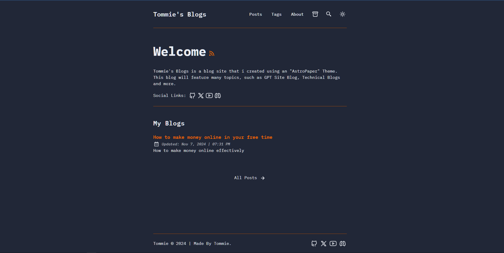

# AstroPaper

Tommie's Blogs was created using the "Astro Paper" Theme.

AstroPaper is a minimal, responsive, accessible and SEO-friendly Astro blog theme. 

## 🔥 Features Included

- [x] type-safe markdown
- [x] super fast performance
- [x] accessible (Keyboard/VoiceOver)
- [x] responsive (mobile ~ desktops)
- [x] SEO-friendly
- [x] light & dark mode
- [x] fuzzy search
- [x] draft posts & pagination
- [x] sitemap & rss feed
- [x] followed best practices
- [x] highly customizable
- [x] dynamic OG image generation for blog posts [#15](https://github.com/satnaing/astro-paper/pull/15) ([Blog Post](https://astro-paper.pages.dev/posts/dynamic-og-image-generation-in-astropaper-blog-posts/))