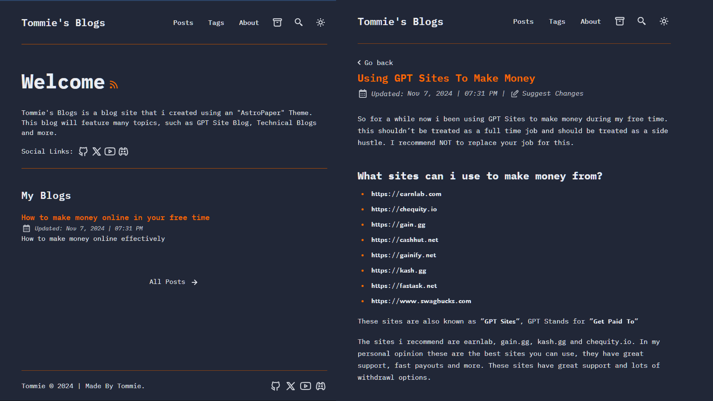

I Made "Tommie's Blogs" using an "Astro Paper" Theme.

AstroPaper is a minimal, responsive, accessible and SEO-friendly Astro blog theme. This theme is designed and crafted based on [my personal blog](https://eliteblogwebsite.pages.dev/).

Installing this theme can be confusing if your a new user to github, i recommend following the installation guide i made below :)

## Features Included

- [x] type-safe markdown
- [x] super fast performance
- [x] accessible (Keyboard/VoiceOver)
- [x] responsive (mobile ~ desktops)
- [x] SEO-friendly
- [x] light & dark mode
- [x] fuzzy search
- [x] draft posts & pagination
- [x] sitemap & rss feed
- [x] followed best practices
- [x] highly customizable
- [x] dynamic OG image generation for blog

## How To Install This Theme

1. Head over to https://github.com/satnaing/astro-paper
2. Clone the astro paper repository 
3. Make a new repository, name it whatever you want.
4. Add all the files you clone and put them into your repository folder.
5. After all the files are in your repository, you can now deploy your site.

𝗶𝗳 𝘆𝗼𝘂 𝗴𝗲𝘁 𝗲𝗿𝗿𝗼𝗿𝘀 𝘄𝗵𝗲𝗻 𝗱𝗲𝗽𝗹𝗼𝘆𝗶𝗻𝗴 𝘁𝗼 𝗚𝗶𝘁𝗛𝘂𝗯, 𝗜 𝗿𝗲𝗰𝗼𝗺𝗺𝗲𝗻𝗱 𝘂𝘀𝗶𝗻𝗴 𝗰𝗹𝗼𝘂𝗱 𝗳𝗹𝗮𝗿𝗲 𝗼𝗿 𝘃𝗲𝗿𝗰𝗲𝗹 𝘁𝗼 𝗱𝗲𝗽𝗹𝗼𝘆 𝘆𝗼𝘂𝗿 𝘀𝗶𝘁𝗲.

